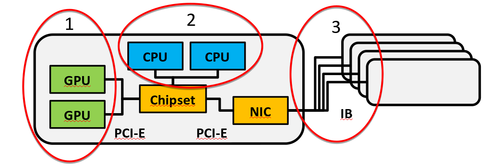

# High-performance computing

- High performance computing is fueled by ever increasing performance
- Increasing performance allows breakthroughs in many major challenges that
  humankind faces today
- Not only hardware performance, algorithmic improvements have also added
  ordered of magnitude of real performance

# HPC through the ages

- Achieving performance has been based on various strategies throughout the
  years
- Frequency, vectorization, multinode, multicore ...
- Now performance is mostly limited by power consumption
- Accelerators provide compute resources based on a very high level of
  parallelism to reach high performance at low relative power consumption

# Accelerators

- Specialized parallel hardware for floating point operations
    - Co-processors for traditional CPUs
    - Based on highly parallel architectures
    - Graphics processing units (GPU) have been the most common accelerators
      during the last few years
- Promises
    - Very high performance per node
- Usually major rewrites of programs required

# Accelerator model today

- Connected to CPUs via PCIe
- Local memory
    - Smaller than main memory (32 GB in Puhti)
- Very high bandwidth (up to 900 GB/s)
- Latency high compared to compute performance
- Data must be copied over the PCIe bus

{}
{width=100%}

# GPU architecture

- Designed for running tens of thousands of threads simultaneously on
  thousands of cores
- Very small penalty for switching threads
- Running large amounts of threads hides memory access penalties
- Very expensive to synchronize all threads

# Challenges in using Accelerators

**Applicability**: Is your algorithm suitable for GPU?

**Programmability**: Is the programming effort acceptable?

**Portability**: Rapidly evolving ecosystem and incompatibilities between
vendors.

**Availability**: Can you access a (large scale) system with GPUs?

**Scalability**: Can you scale the GPU software efficiently to several nodes?

# Using GPUs

1. Use existing GPU applications
2. Use accelerated libraries
3. Directive based methods
    - OpenMP
    - **OpenACC**
4. Use lower level language
    - CUDA
    - HIP
    - OpenCL

Easier, but more limited

{ width=15% }

More difficult, but more opportunities

# Directive-based accelerator languages

- Annotate code to mark accelerator-offloadable regions
- OpenACC
    - focus on optimizing productivity (reasonably good performance with
      minimal effort)
    - created in 2011, latest version is 3.1 (November 2020)
    - mostly Nvidia only
- OpenMP
    - de-facto standard for shared-memory parallelisation
    - initial support for accelerators in 4.0 (2013)
    - significant improvements/extensions in 4.5 (2015), 5.0 (2018),
      and 5.1 (2020)
