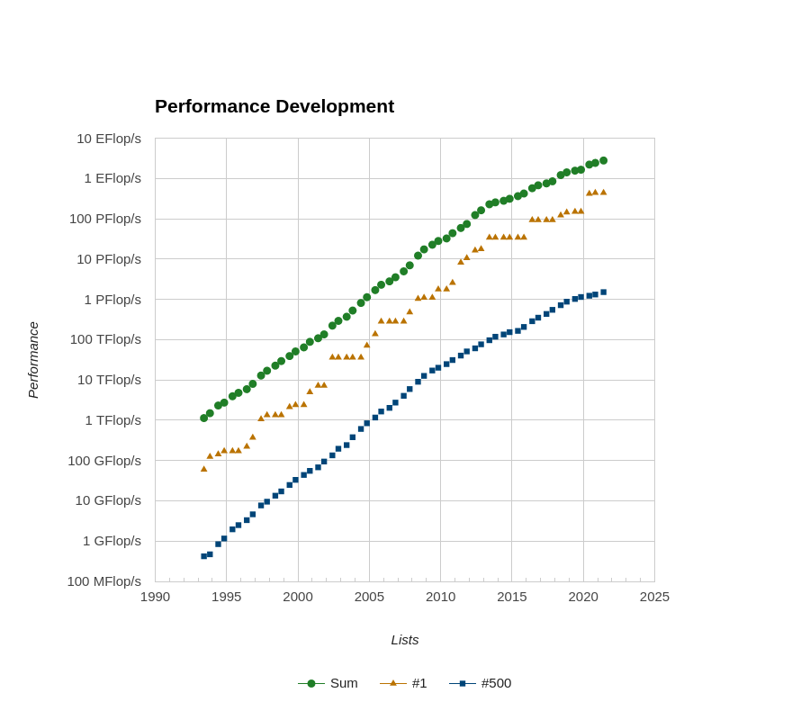

# High-performance computing

<div class="column">
- High performance computing is fueled by ever increasing performance
- Increasing performance allows breakthroughs in many major challenges that
  humankind faces today
- Not only hardware performance, algorithmic improvements have also added
  ordered of magnitude of real performance
</div>

<div class="column">

</div>


# HPC through the ages

<div class="column">
- Achieving performance has been based on various strategies throughout the
  years
    - frequency, vectorization, multinode, multicore, ...
    - now performance is mostly limited by power consumption
- Accelerators provide compute resources based on a very high level of
  parallelism to reach high performance at low relative power consumption
</div>

<div class="column">

</div>

- Pre-exascale systems in the EU
- New exascale systems in the US

# Reaching for exascale with accelerators (EU)

<div class="column">
- **LUMI** (2021/2022), CSC, ~0.55 EF, *AMD EPYC CPUs + AMD Instinct GPUs*

</div>

<div class="column">
- **Leonardo** (2022), Cineca, ~0.32 EF,
  *Intel Ice-Lake/Sapphire Rapids CPUs + NVIDIA Ampere GPUs*
- **Mare Nostrum 5**, BSC, ???
</div>

# Reaching for exascale with accelerators (US)

- **Frontier** (2021), ORNL, ~1.5 EF, *AMD EPYC CPUs + AMD Instinct GPUs*
- **Aurora** (2022), ANL, ~1 EF,
  *Intel Sapphire Rapids CPUs + Intel Ponte Vecchio GPUs*
- **Crossroads** (2022), LANL, ~2 EF, *Intel Sapphire Rapids CPUs*
- **El Capitan** (2023), LLNL, ~2 EF, *AMD EPYC CPUs + AMD Instinct GPUs*


# Accelerators

- Specialized parallel hardware for floating point operations
    - Co-processors for traditional CPUs
    - Based on highly parallel architectures
    - Graphics processing units (GPU) have been the most common accelerators
      during the last few years
    - GPUs are optimised for throughput; CPUs for latency
- Promises
    - Very high performance per node
- Usually major rewrites of programs required


# Accelerator model today

<div class="column">
- Connected to CPUs via PCIe
- Local memory
    - Smaller than main memory (32 GB in Puhti)
- Very high bandwidth (up to 1.2 TB/s)
- Latency high compared to compute performance
- Data must be copied over the PCIe bus
</div>

<div class="column">
{}
{width=100%}
</div>


# GPU architecture

<div class="column">
- Designed for running tens of thousands of threads simultaneously on
  thousands of cores
- Very small penalty for switching threads
- Running large amounts of threads hides memory access penalties
- Very expensive to synchronize all threads
</div>

<div class="column">

<small>AMD Instinct MI100 architecture (source: AMD)</small>
</div>


# Challenges in using Accelerators

**Applicability**: Is your algorithm suitable for GPU?

**Programmability**: Is the programming effort acceptable?

**Portability**: Rapidly evolving ecosystem and incompatibilities between
vendors.

**Availability**: Can you access a (large scale) system with GPUs?

**Scalability**: Can you scale the GPU software efficiently to several nodes?


# Using GPUs

<div class="column">
1. Use existing GPU applications
2. Use accelerated libraries
3. Directive based methods
    - OpenMP
    - OpenACC
4. Explicit code targeting GPUs
    - CUDA
    - HIP
    - SYCL, Kokkos, ...
</div>

<div class="column">
Easier, but more limited

{ width=15% }

More difficult, but more opportunities
</div>


# Directive-based GPU programming

- Annotate code to mark accelerator-offloadable regions
- OpenACC
    - created in 2011, latest version is 3.1 (November 2020)
    - mostly Nvidia only
- OpenMP
    - de-facto standard for shared-memory parallelisation
    - initial support for accelerators in 4.0 (2013)
    - significant improvements/extensions in 4.5 (2015), 5.0 (2018),
      and 5.1 (2020)
- Can reach reasonable performance with quite limited effort (not guaranteed!)


# HPC frameworks / language extensions

- Kokkos, RAJA, ...
    - hardware support and scalability taken care of by the framework
    - requires code changes to framework specific expressions
    - targeted frameworks (AMReX etc.) may be a better fit for a given field
- SYCL
    - C++ language extension that is getting adopted into the standard
    - syntax similar to Kokkos etc. used to express parallelism
    - compiler automatically generates code for target hardware (incl. GPUs)

<small>
<div class="column">
```cpp
auto cg = [&](handler &cg) {
  auto prev = accessor(buffer_prev, cg, read_only);
  auto next = accessor(buffer_next, cg, read_write);

  cg.parallel_for(range<2>(nx, ny), [=](id<2> xy) {
    auto i = xy[0] + 1;
    auto j = xy[1] + 1;

```
</div>

<div class="column">
```cpp
    next[i][j] = prev[i][j] + a * dt * (
           (prev[i+1,j] - 2.0 * prev[i,j] + prev[i-1,j]) * inv_dx2 +
           (prev[i,j+1] - 2.0 * prev[i,j] + prev[i,j-1]) * inv_dy2
           );
    }
}
q.submit(cg);
```
</div>
</small>


# Native GPU code: HIP / CUDA

- CUDA
    - has been the *de facto* standard for native GPU code for years
    - extensive set of optimised libraries available
    - custom syntax (extension of C++) supported only by CUDA compilers
    - support only for NVIDIA devices
- HIP
    - AMD effort to offer a common programming interface that works on
      both CUDA and ROCm devices
    - standard C++ syntax, uses nvcc/hcc compiler in the background
    - almost a one-on-one clone of CUDA from the user perspective
    - ecosystem is new and developing fast
