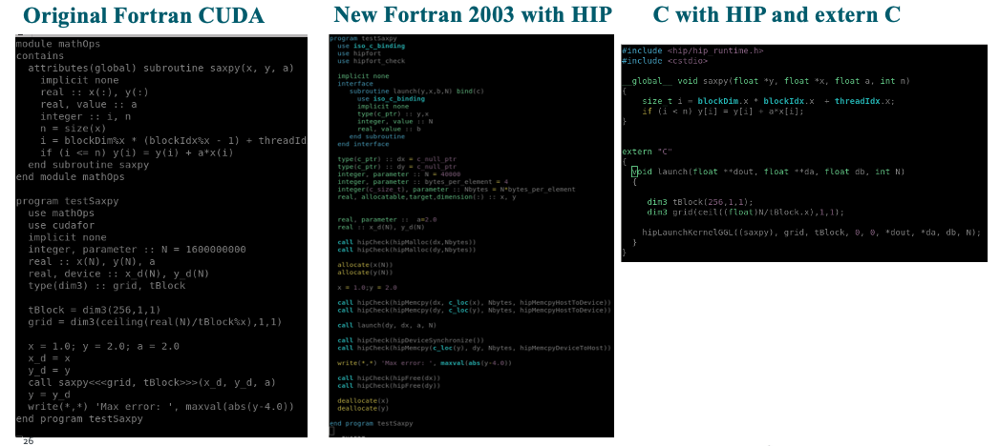

# Fortran

* First Scenario: Fortran + CUDA C/C++
	- Assuming there is no CUDA code in the Fortran files.
	- Hipify CUDA
	- Compile and link with hipcc
* Second Scenario: CUDA Fortran
	- There is no HIP equivalent
	- HIP functions are callable from C, using `extern C`
	- See hipfort

# Hipfort

The approach to port Fortran codes on AMD GPUs is different, the hipify tool does
not support it.

* We need to use hipfort, a Fortran interface library for GPU kernel
* Steps:
	1) We write the kernels in a new C++ file
	2) Wrap the kernel launch in a C function
	3) Use Fortran 2003 C binding to call the C function
	4) Things could change
* Use OpenMP offload to GPUs

# Fortran SAXPY example

* Fortran CUDA, 29 lines of code
* Ported to HIP manually, two files of 52 lines, with more than 20 new lines.
* Quite a lot of changes for such a small code.
* Should we try to use OpenMP offload before we try to HIP the code?
* Need to adjust Makefile to compile the multiple files
* Example of Fortran with HIP: https://github.com/csc-training/hip-programming/hipfort

# HIPFort code

# GPUFort

---

# GPUFort (II)

---
# GPUFort (III)

---

# Fortran and OpenACC

* The CRAY Fortran compiler supports OpenACC v2.7
* Support for OpenACC 3.0 around June 2022
* By the end of 2022 the compiler will be up  to the standard in OpenACC
* Only Fortran and OpenACC will be supported from HPE programming environment, no C/C++
* For now is not the recommended approach, if a code is already in OpenACC, then you can investigate its performance
